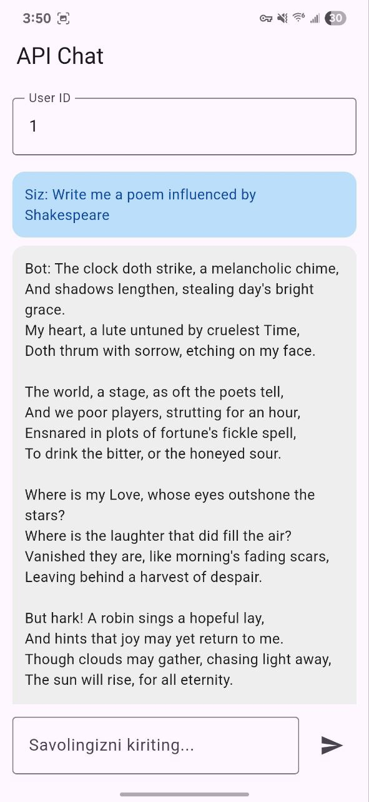

# AI Mobile App

## 📱 Download APK

---[[Download]](https://github.com/azizbekrakhimjonov/ai_mobile/releases/download/v1.0.0/ai.apk)---

## 🔧 Installation

1. Yuqoridagi havolani bosing
2. APK faylini yuklab oling
3. Telefoningizda noma'lum manbalardan ilovalarni o'rnatishga ruxsat bering
4. Yuklab olingan APK faylini oching va o'rnatishni boshlang
5. O'rnatish tugagach, ilovani oching va foydalanishni boshlang
6. Xavfsizlik uchun, ilovani o'rnatgandan so'ng noma'lum manbalardan ilovalarni o'rnatishga ruxsat berishni o'chirib qo'ying

## 📱 App Screenshots

### Main Features

# Bu buyruq eng kichik APK beradi
`flutter build apk --release --split-per-abi --obfuscate --split-debug-info=build/debug-info`

## Telefoningiz 64-bit bo'lsa: app-arm64-v8a-release.apk

## Eski telefonlar uchun: app-armeabi-v7a-release.apk

### Emulyator yoki Intel protsessorli qurilmalar uchun: app-x86_64-release.apk

